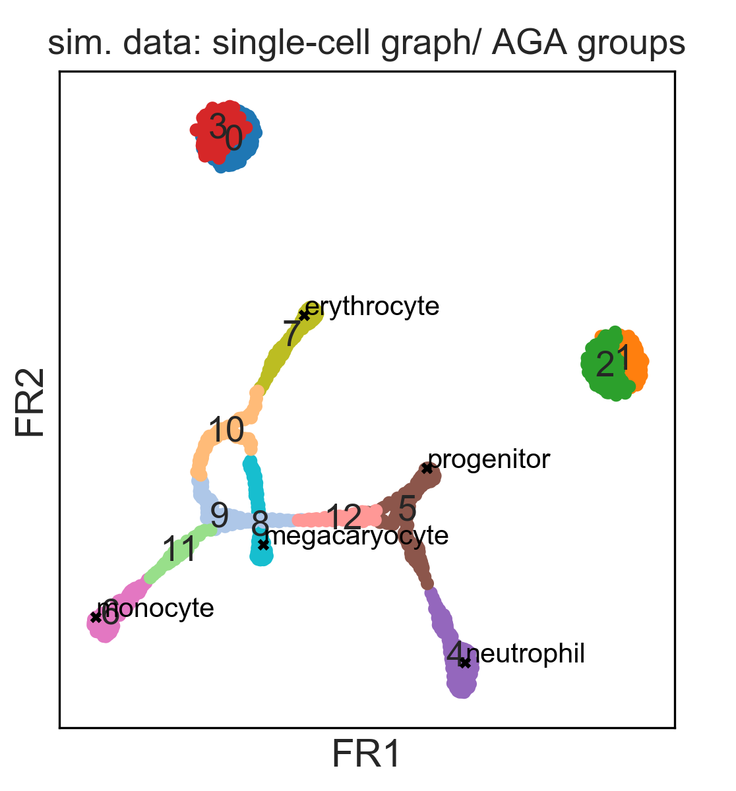
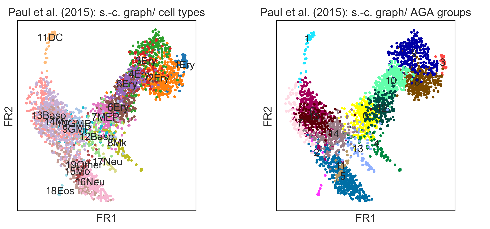
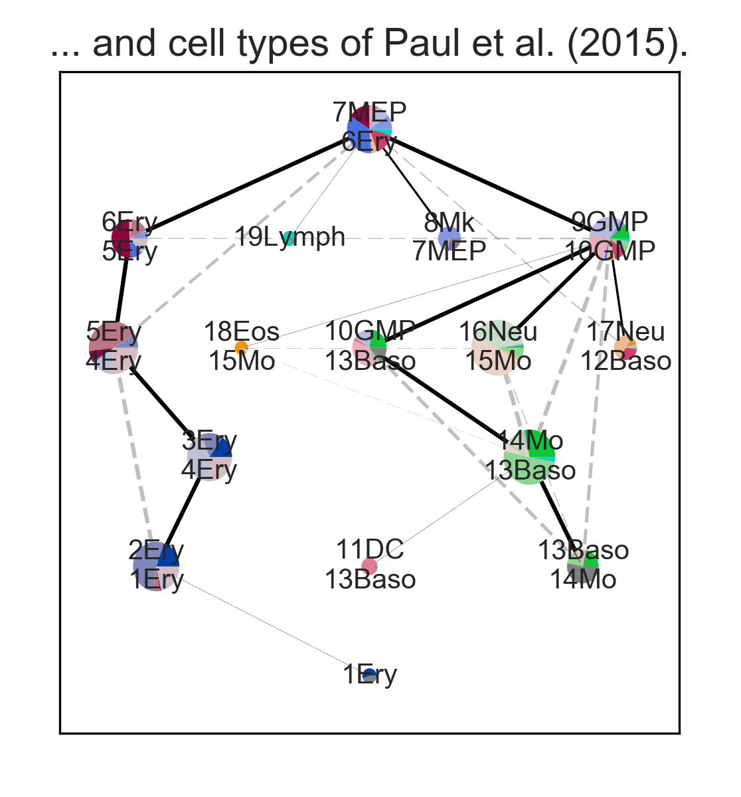
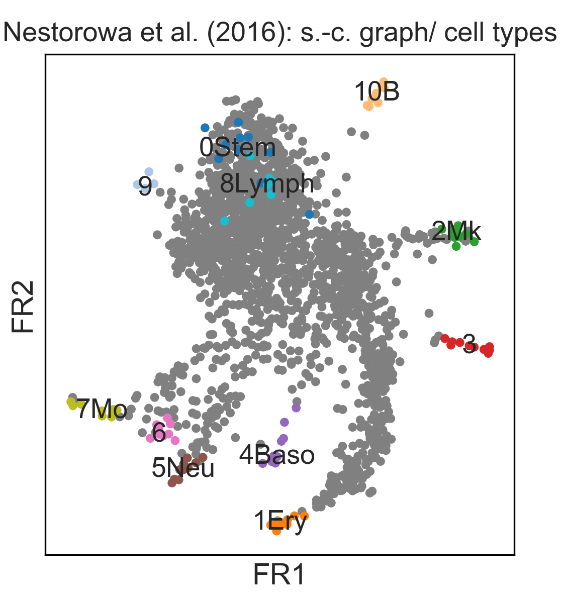
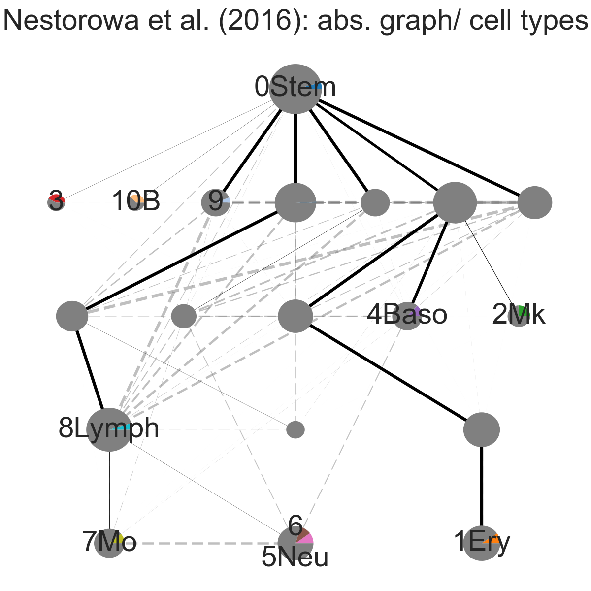
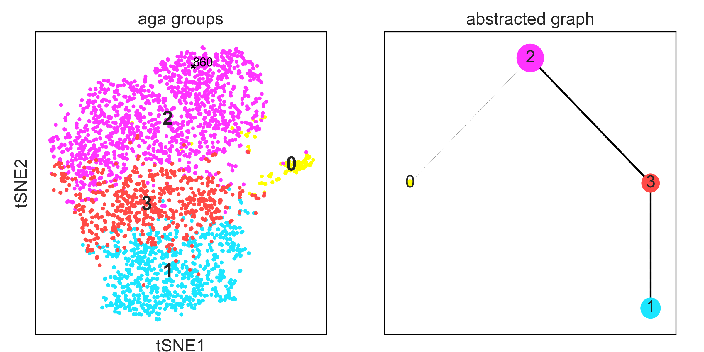
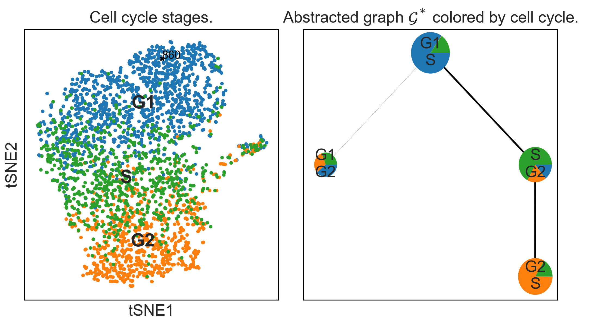
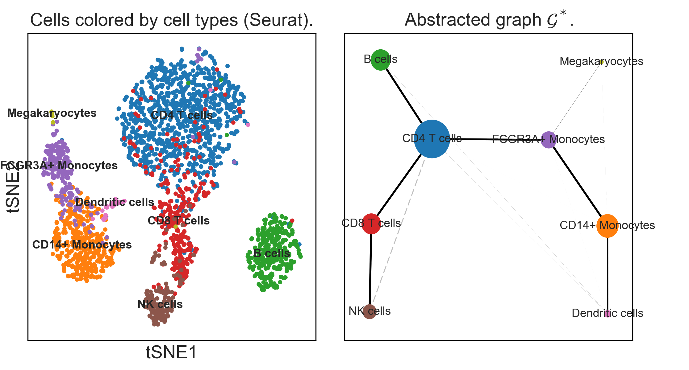
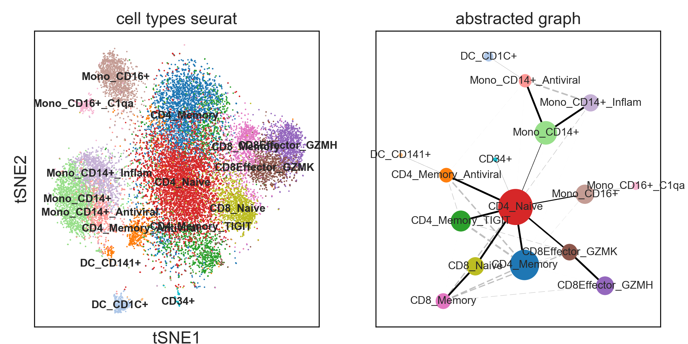
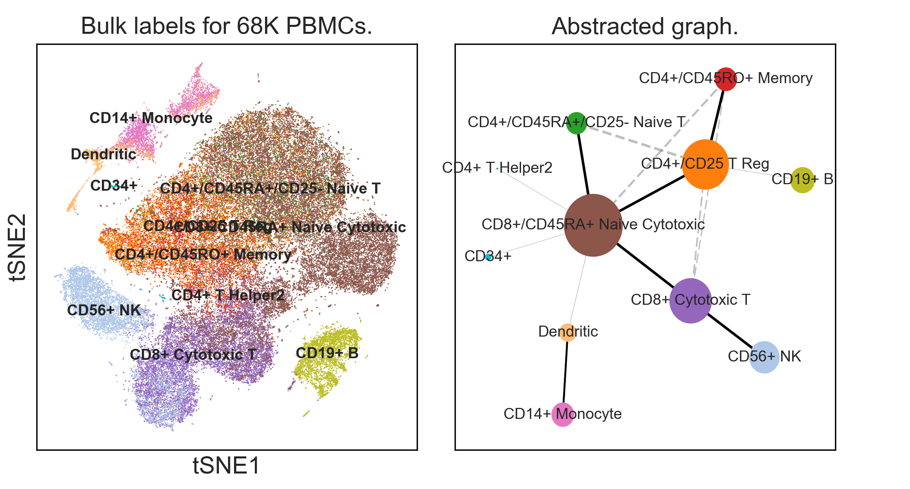

# Graph abstraction relates subgroups of single cells

### Minimal examples with known ground truth

In [*minimal_examples*](minimal_examples), we study clean simulated datasets
with known ground truth. In particular, a dataset that contains a tree-like
continuous manifold and clusters. We discuss in detail how we measure
robustness, how to reproduce figures of the paper and how competing algorithms
perform.

### Hematopoietic lineage trees

Here, we consider two well-studied datasets on hematopoietic differentiation.

#### Data from [Paul *et al.* (2015)](http://doi.org/10.1016/j.cell.2015.11.01)

In [*paul15*](paul15), we analyze data for myeloid progenitor development. This is the same
data, which has served as benchmark for Monocle 2 [(Qiu *et al.*,
  Nat. Meth., 2017)](https://doi.org/10.1038/nmeth.4402) and DPT [(Haghverdi *et al.*, Nat. Meth.,
  2016)](https://doi.org/10.1038/nmeth.3971)

#### Data from [Nestorowa, Hamey, *et al.* (2016)](http://doi.org/10.1182/blood-2016-05-716480)

In [*nestorowa16*](nestorowa16), we analyze data for early hematopoietic differentation.

### Lineage tree for whole cell atlas of an adult animal

In [*planaria*](planaria), we reconstruct the lineage tree of the whole cell atlas
of planaria (Plass, Jordi *et al.*, in preparation, 2017).

### Deep Learning

In [*deep_learning*](deep_learning), we use deep learning to generate a feature space and, by that, a distance metric, which induces a nearest-neighbor graph. For the problem of reconstructing cell-cycle [Eulenberg, Köhler, *et al.*, Nat. Commun. (2017)](https://doi.org/10.1101/081364), we find that graph abstraction correctly separates a small cluster of dead cells from the cell evolution through G1, S and G2 phase.

### PBMC cells

For all of the following scRNA-seq datasets ([3K](https://support.10xgenomics.com/single-cell-gene-expression/datasets/1.1.0/pbmc3k), [33K](https://support.10xgenomics.com/single-cell-gene-expression/datasets/1.1.0/pbmc33k) and [68K](https://doi.org/10.1038/ncomms14049) PBMC cells, all 10X Genomics), graph abstraction reconstructs correct lineage motifs. As the data is disconnected in large parts, a global lineage tree cannot be inferred.

