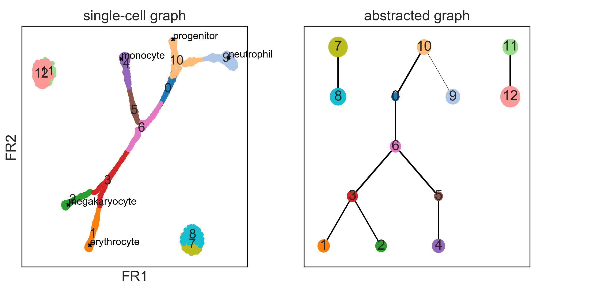
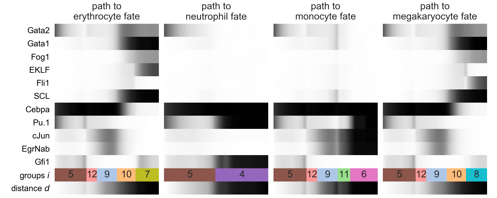
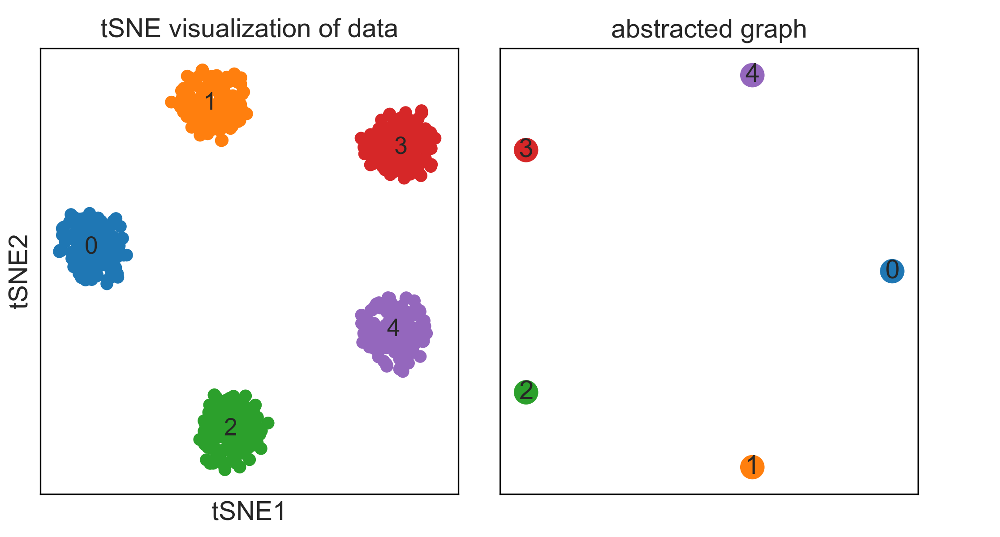
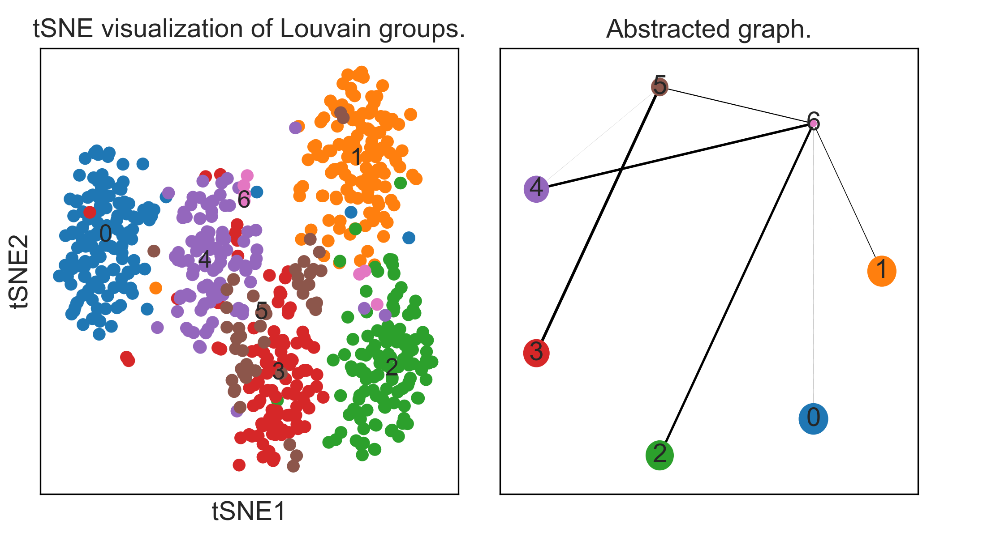
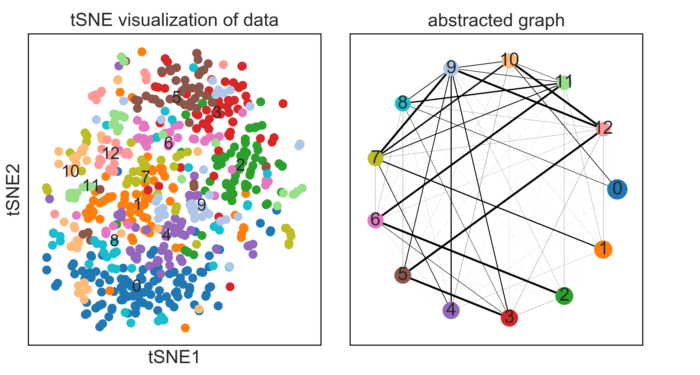
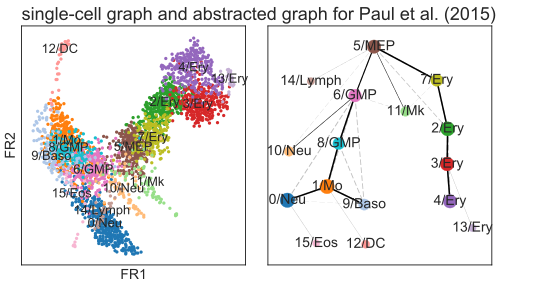
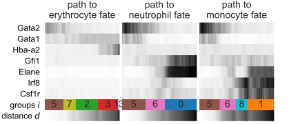
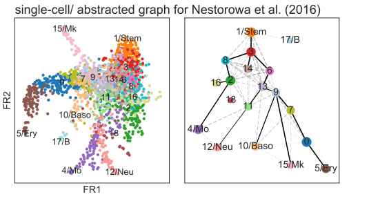
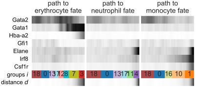

# Graph abstraction reconciles clustering with trajectory inference through a topology preserving map of single cells

*Partition-based graph abstraction* (PAGA) is available within
[Scanpy](https://scanpy.readthedocs.io). Central toplevel functions are:
* [`scanpy.api.tools.paga`](https://scanpy.readthedocs.io/en/latest/api/scanpy.api.tl.paga.html)
* [`scanpy.api.plotting.paga`](https://scanpy.readthedocs.io/en/latest/api/scanpy.api.pl.paga.html)
* [`scanpy.api.plotting.paga_path`](https://scanpy.readthedocs.io/en/latest/api/scanpy.api.pl.paga_path.html)
* [`scanpy.api.plotting.paga_compare`](https://scanpy.readthedocs.io/en/latest/api/scanpy.api.pl.paga_compare.html)

Central example notebooks are

* [*minimal_examples*](https://nbviewer.jupyter.org/github/theislab/graph_abstraction/blob/master/minimal_examples/minimal_examples.ipynb): minimal simulated examples
* [*paul15*](https://nbviewer.jupyter.org/github/theislab/graph_abstraction/blob/master/paul15/paul15.ipynb): myeloid progenitor development
* [*nestorowa16*](https://nbviewer.jupyter.org/github/theislab/graph_abstraction/blob/master/nestorowa16/nestorowa16.ipynb): early hematopoietic differentation
* [*planaria*](https://nbviewer.jupyter.org/github/rajewsky-lab/planarian_lineages/blob/master/paga/preprocessing.ipynb): the planarian lineage tree (see [*planarian_lineages*](https://github.com/rajewsky-lab/planarian_lineages))

The example figures that follow below represent the results of an earlier implementation of PAGA. We will soon update this - however, results changed only superficially.

Our preprint will soon be updated but contains the essential ideas: [Wolf *et al.*, bioRxiv (2017)](https://doi.org/10.1101/208819).

### Minimal examples with known ground truth

In [*minimal_examples*](minimal_examples), we study clean simulated datasets
with known ground truth. In particular, a dataset that contains a tree-like
continuous manifold and disconnected clusters...

... and simple datasets that illustrate connectivity patterns of clusters.

Also, you find an explanation of how to [*zoom in*](minimal_examples/#zooming-into-particular-regions-of-the-data) into particular regions of the dataset.

### Differentiation manifolds in hematopoiesis

Here, we consider two well-studied datasets on hematopoietic differentiation.

#### Data from [Paul *et al.* (2015)](http://doi.org/10.1016/j.cell.2015.11.01)

In [*paul15*](paul15), we analyze data for myeloid progenitor development. This is the same
data that has served as benchmark for Monocle 2 [(Qiu *et al.*,
  Nat. Meth., 2017)](https://doi.org/10.1038/nmeth.4402) and DPT [(Haghverdi *et al.*, Nat. Meth.,
  2016)](https://doi.org/10.1038/nmeth.3971).

**Note**: Unfortunately, Firefox does not display the svg heatmaps properly, all other browers do.

#### Data from [Nestorowa, Hamey *et al.* (2016)](http://doi.org/10.1182/blood-2016-05-716480)

In [*nestorowa16*](nestorowa16), we analyze data for early hematopoietic differentation.

### Lineage tree for whole cell atlas of an adult animal

In [*planaria*](planaria), we reconstruct the lineage tree of the whole cell atlas
of planaria (Plass, Jordi *et al.*, submitted, 2017).

### Deep Learning

In [*deep_learning*](deep_learning), we use deep learning to generate a feature space and, by that, a distance metric, which induces a nearest-neighbor graph. For the problem of reconstructing cell-cycle [Eulenberg, Köhler, *et al.*, Nat. Commun. (2017)](https://doi.org/10.1101/081364), we find that graph abstraction correctly separates a small cluster of dead cells from the cell evolution through G1, S and G2 phase.

### PBMC cells

For all of the following scRNA-seq datasets ([3K](https://support.10xgenomics.com/single-cell-gene-expression/datasets/1.1.0/pbmc3k) and [68K](https://doi.org/10.1038/ncomms14049) PBMC cells, all 10X Genomics), graph abstraction reconstructs correct lineage motifs. As the data is disconnected in large parts, a global lineage tree cannot be inferred.

