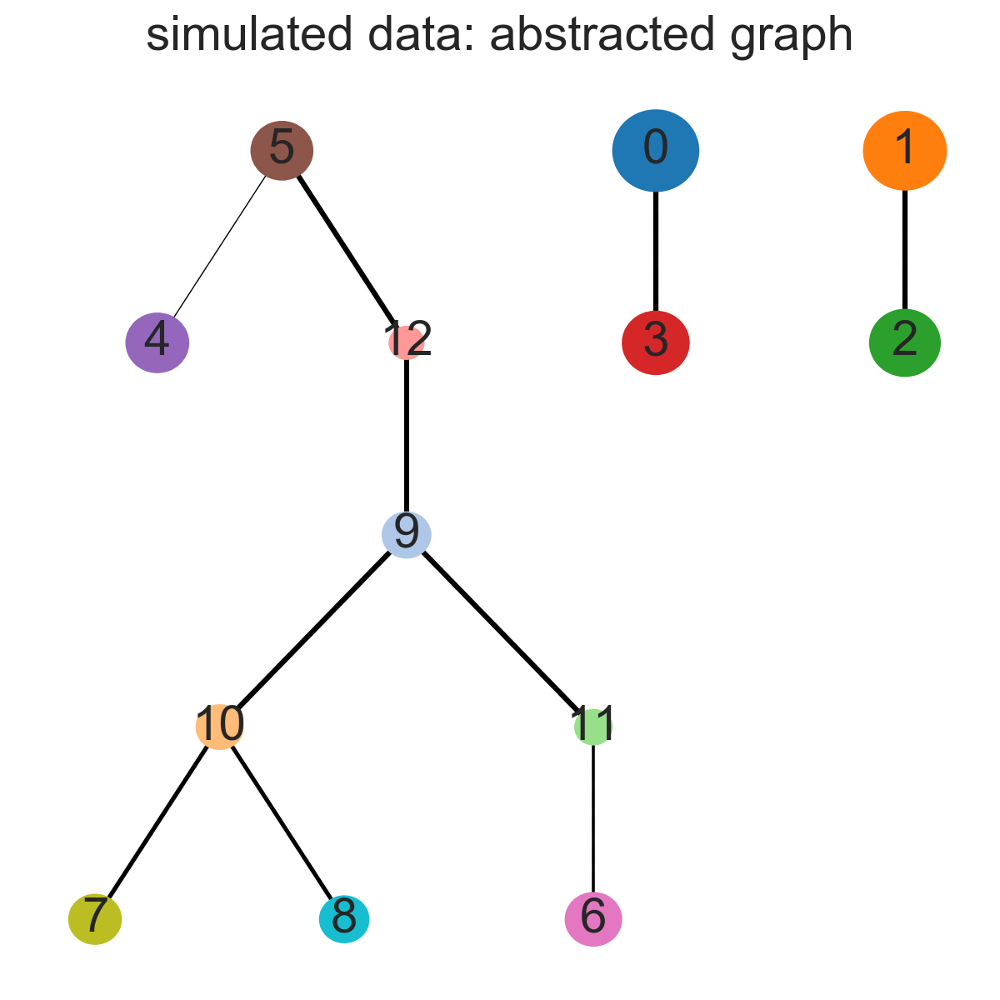

## Graph abstraction relates subgroups of single cells

### Illustration using simulated data

Correct reconstruction of a simulated hematopoietic lineage tree in the presence
of disconnected clusters.

See [*sim_data*](sim_data) for details, robustness and how to reproduce Figure 1.

### Hematopoietic lineage trees

#### Data from [Paul *et al.* (2015)](http://doi.org/10.1016/j.cell.2015.11.01)

For details, see [here](./paul15/).

#### Data from [Nestorowa *et al.* (2016)](http://doi.org/10.1182/blood-2016-05-716480)

For details, see [here](./nestorowa16).

### Lineage tree of whole adult animal

For details, see [here](./planaria).

### PBMC cells

From the literature.

All of the following datasets contain correct motifs from this tree, but as they are quite strongly clustering, the global tree cannot be inferred.

What would be needed would be data that contained all the intermediate states.

#### 3K cells from [10X (2017)](https://support.10xgenomics.com/single-cell-gene-expression/datasets/1.1.0/pbmc3k)

For details, see [here](pbmc3k.html).

#### 33K cells from [10X (2017)](https://support.10xgenomics.com/single-cell-gene-expression/datasets/1.1.0/pbmc33k)

For details, see [here](pbmc33k.html).

#### 68K cells from [Zheng *et al.* (2017)](https://doi.org/10.1038/ncomms14049)

For details, see [here](zheng17.html).

