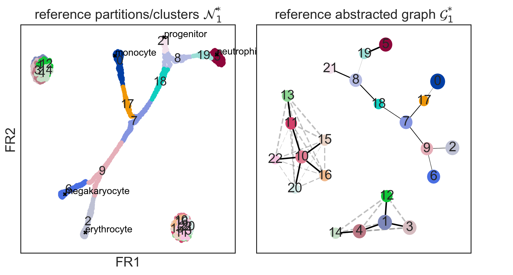
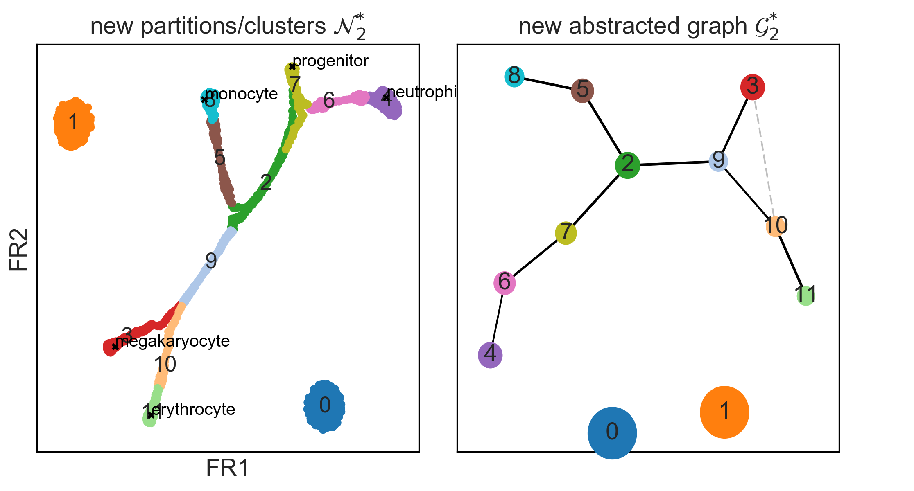
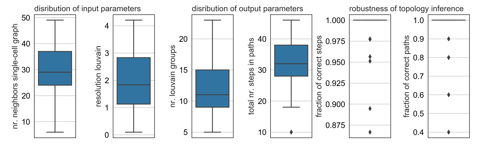

*First compiled: September 13, 2017.*

## Studying simple and clean simulated datasets

### Contents

* [*minimal_examples*](minimal_examples.ipynb) contains the main results
* [*robustness*](robustness.ipynb) studies the robustness of these results
* [*comparisons*](comparisons) discusses results obtained with other algorithms
  ([*comparisons_exports*](comparisons_exports.ipynb) exports data)

### Summary Tree Inference

Here, we study a simple, almost noise-free simulated dataset, which serves as a
minimal example with an unambiguous ground truth
([*krumsiek11_blobs/X.csv*](comparisons/data/krumsiek11_blobs/X.csv)). The data
contains two clusters and a continous tree-like manifold associated with
[simulated hematopoietic
differentiation](https://github.com/theislab/scanpy_usage/tree/master/170430_krumsiek11). Below,
we reproduce the abstracted graph and the inferred tree of Figure 1 of the
paper:


### Comparison with competing algorithms

In [*comparisons*](comparisons), we show that only graph abstraction provides meaningful results for the minimal datasets.

### Robustness

If we change parameters in graph abstraction, we obtain seemingly very different
abstractions of the data. Here, for a fine-grained resolution



and here, with a very coarse-grained resolution:



Upon closer inspection, one realizes that all results represent the same
topology and are correct. To measure how much two tree topologies differ, we
suggest to compare all paths between leaf nodes in the inferred abstracted
graphs. For example,
```
      path = ['21', '8', '18', '7', '9', '2'],
path_mapped = [['7', '2'], ['6', '7', '2'], ['2', '7'], ['2', '9'], ['9', '10', '3'], ['11', '10']],
      path_new = ['7', '2', '9', '10', '11'],
-> n_agreeing_steps = 4 / n_steps = 4.
```
agree.

For the simulated dataset, graph abstraction almost always yields the correct
topology; no matter which parameters are chosen.



See [*robustness*](robustness.ipynb) for all details.

### Different degrees of clustering

In [*minimal_examples*](minimal_examples.ipynb), we also show how graph abstraction behaves on
data with different degrees of clustering.


