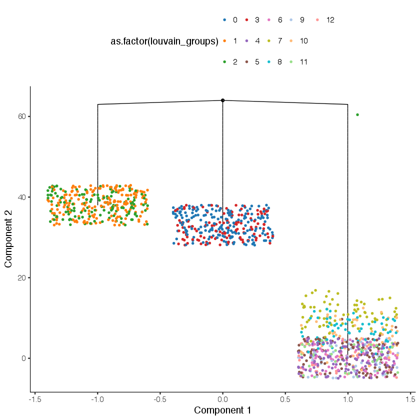
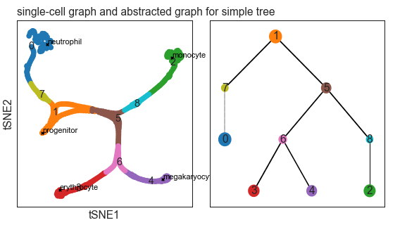
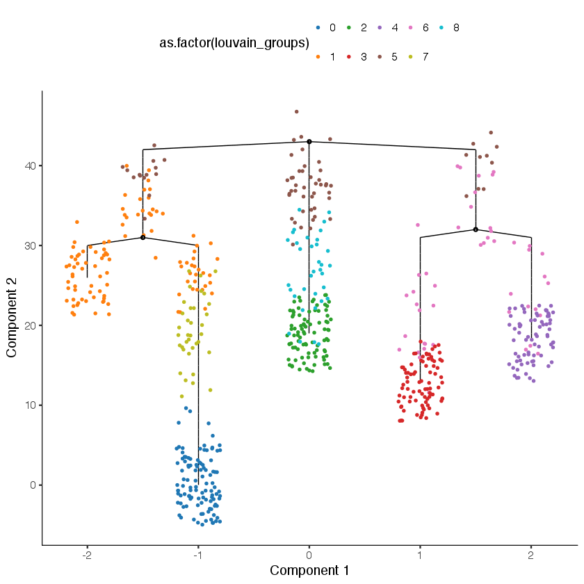
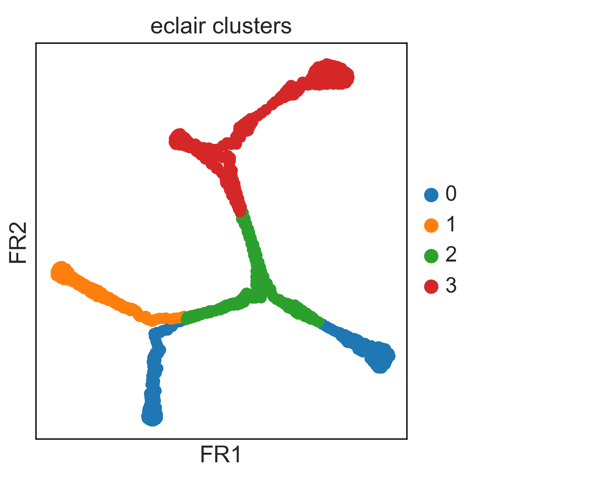
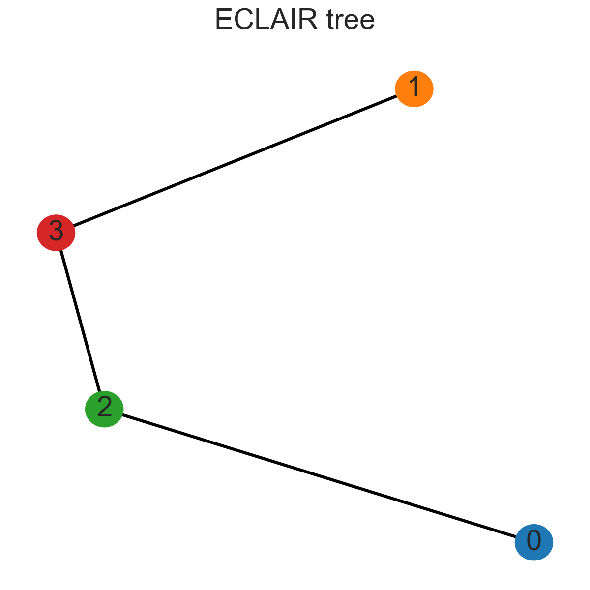
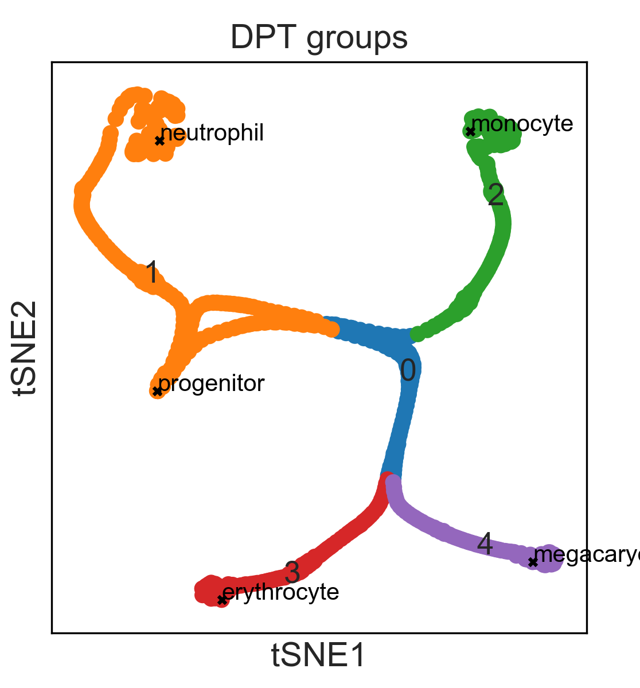
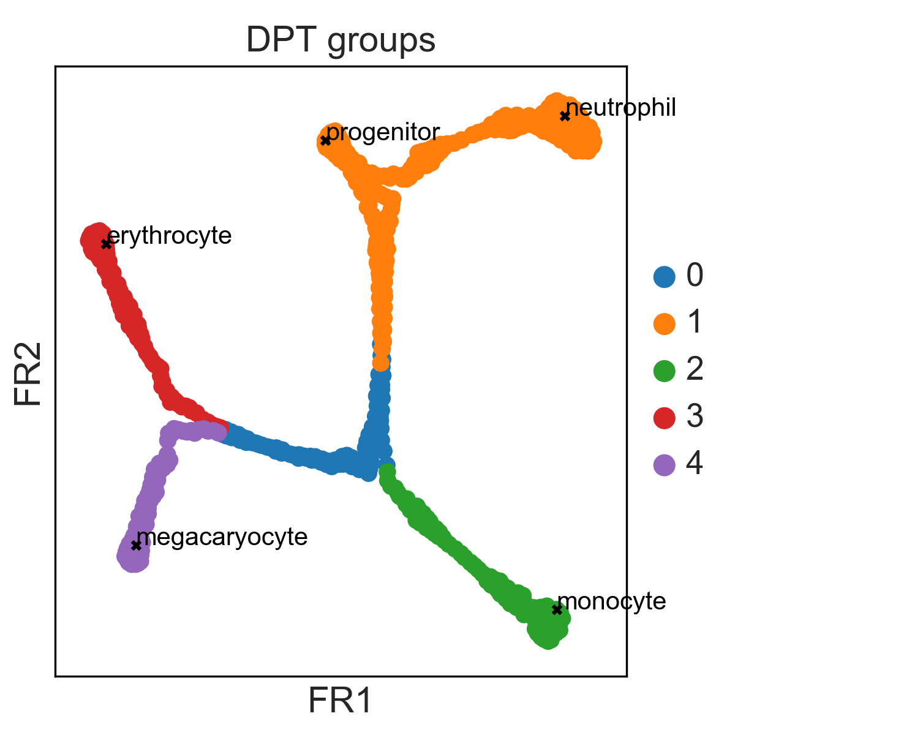
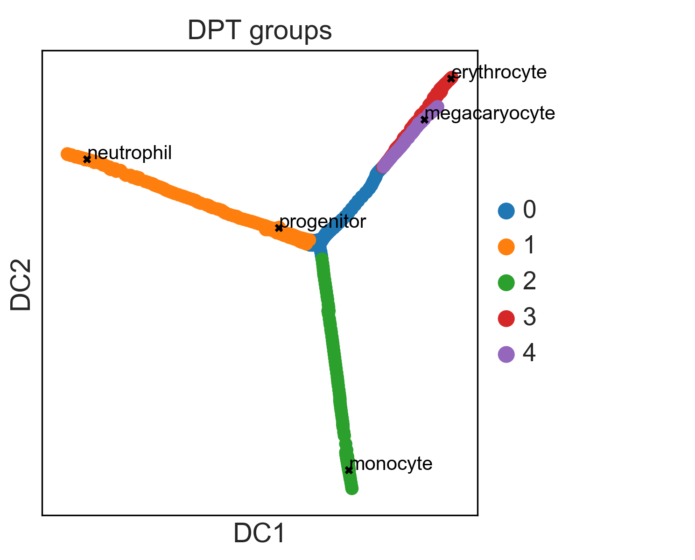
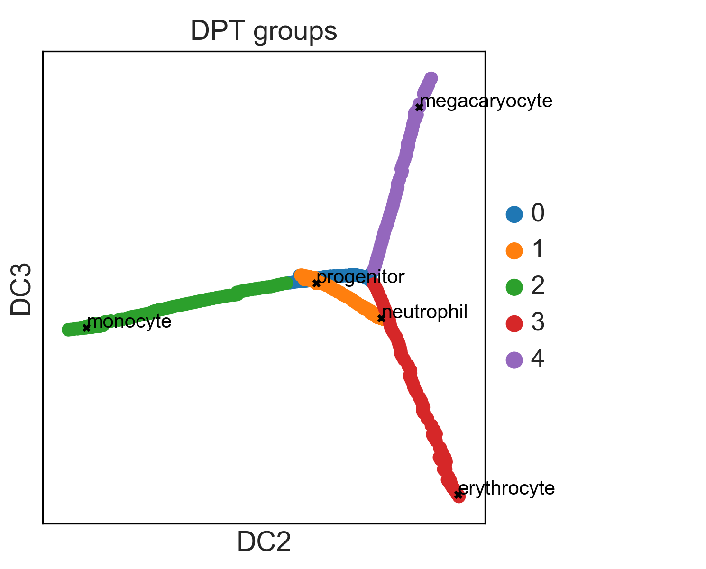
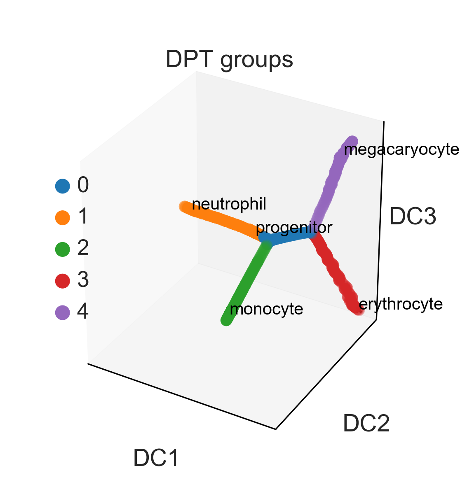

*First compiled: September 13, 2017.*

## Comparisons

### Contents

* [*stemID2*](stemID) contains the analysis using StemID [(Grün *et al.*, Cell Stem Cell,
  2016)](https://doi.org/10.1016/j.stem.2016.05.010)
* [*monocle2*](monocle2.ipynb) contains the Monocle 2 analysis [(Qiu *et al.*,
  Nat. Meth., 2017)](https://doi.org/10.1038/nmeth.4402)
* [*DPT*](dpt.ipynb) contains the DPT analysis [(Haghverdi *et al.*, Nat. Meth.,
  2016)](https://doi.org/10.1038/nmeth.3971)
* [*eclair*](eclair) contains the analysis using Eclair [(Giecold *et al.*, Nucl. Acids
  Research, 2016)](https://doi.org/10.1093/nar/gkw452)

### Summary

Recall the example of a continuous tree-like manifold with clusters (Figure 1 of the paper, [*krumsiek11_blobs/X.csv*](data/krumsiek11_blobs/X.csv)). This data has a clearly defined ground truth and very little noise. The following shows the result by graph abstraction. The computation took 0.55 s.

Among the competing algorithms, only StemID 2, the successor of StemID [(Grün *et al.*, Cell Stem Cell, 2016)](https://doi.org/10.1016/j.stem.2016.05.010), is able to produce sensible results for this dataset. It produces a lineage tree that is partly correct (left panel) . The underlying sampled clusters and minimum spanning trees recognize one cluster as disconnected, but misinterpret the other cluster (right panel).

The stemID computation, including tSNE, ran for 17 min [(*stemID*)](stemID). Comparing this with 0.5 s for graph abstraction and 2.8 s for tSNE, both in Scanpy ([*minimal_examples*](../minimal_examples.ipynb)), Scanpy is 309 times faster.

Monocle 2 is highly sensitive to the clusters in the data and hence not able to produce any meaningful result for this data, regardless of the choice of parameters. The three branches in the Monocle tree correspond to the two clusters and the continuous manifold (coloring as in the Scanpy figure above and Figure 1 of the paper).

The Monocle 2 computation took 13.8 s [(*monocle2*)](monocle2.ipynb) in the fastest case. Comparing this with 0.5 s for graph abstraction [(*../sim_data*)](../sim_data.ipynb), Scanpy is 28 times faster.

We could not produce any result neither with Eclair [(Giecold *et al.*,
  Nucl. Acids Research, 2016](https://doi.org/10.1093/nar/gkw452)] nor with DPT
  [(Haghverdi *et al.*, Nat. Meth., 2016)](https://doi.org/10.1038/nmeth.3971)
  for this dataset.

#### Reconstructing a simple tree

To obtain sensible results also with Monocle 2, Eclair and DPT, we considered a simpler dataset that only contains the continous tree-like manifold [*krumsiek11/X.csv*](data/krumsiek11/X.csv). The abstracted graph for this looks as follows:

Monocle 2 can now be tuned to yield a sensible result, which agrees with the result obtained using graph abstraction:

Eclair [(Giecold *et al.*, Nucl. Acids Research, 2016)](https://doi.org/10.1093/nar/gkw452) obtains a wrong result even for the simple tree.

DPT [(Haghverdi *et al.*, Nat. Meth., 2016)](https://doi.org/10.1038/nmeth.3971) does, by construction, not infer a lineage tree but merely detects branching subgroups; similar to a clustering algorithm. The branching groups detected for this simple dataset are meaningful.

The visualization in diffusion maps looks as follows:

Note that the choice of branching subgroups made by DPT looks very natural in diffusion maps but a bit more arbitrary in tSNE or graph drawing (FR).
