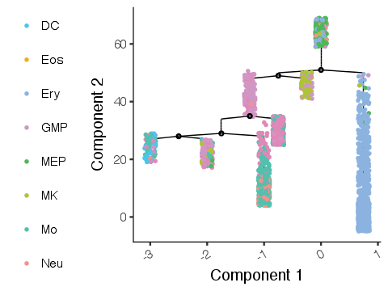
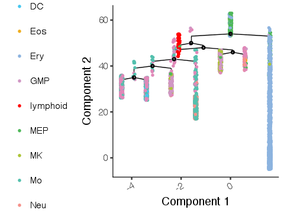

*First compiled: June 3, 2017.*

## Graph abstraction for data of [Paul *et al.*, Cell (2015)](https://doi.org/10.1016/j.cell.2015.11.013)

Here, we trace myeloid differentiation for data of [Paul *et al.*, Cell (2015)](https://doi.org/10.1016/j.cell.2015.11.013). Data is available from the original publication, or for convenience, within Scanpy as [`scanpy.api.datasets.paul15`](https://scanpy.readthedocs.io/en/latest/api/scanpy.api.datasets.paul15.html) or as an RData from https://github.com/theislab/scAnalysisTutorial.

### Contents

* [*paul15*](paul15.ipynb) presents the main results obtained with graph abstraction
* [*comparison_monocle2/...original*](comparison_monocle2/monocle2_original.ipynb) reproduces the published results of Monocle 2 [(Qiu *et al.*, Nat. Meth. 2017)](https://doi.org/10.1038/nmeth.4402)
* [*comparison_monocle2/...alternative*](comparison_monocle2/monocle2_alternative.ipynb) produces results obtained with an alternative preprocessing that does not involve removing a lymphoid cluster from the data, but leaves everything else unchanged

### Summary

While [*comparison_monocle2/...original*](comparison_monocle2/monocle2_original.ipynb) reproduces the published results of Monocle 2 [(Qiu *et al.*, Nat. Meth. 2017)](https://doi.org/10.1038/nmeth.4402)

The preprocessing there involves a step that manually removes a cluster of lymphoid cells. But what if we had no labels for this cluster? We could then not remove it from the data and would hope to obtain a meaningful result also with this cluster present.

In [*comparison_monocle2/...alternative*](comparison_monocle2/monocle2_alternative.ipynb), we run Monocle 2 with an alternative preprocessing that does not involve removing the lymphoid cluster from the data, but leaves everything else completely unchanged. The result is the following.

Evidently, the result is entirely different from the previous result. For example, the megaryocyte (MK) state is very distant from the progenitor (MP/EP) cells, even though it is expexted to branch off very early.

